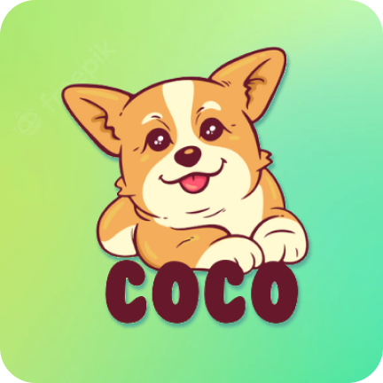

[![Contributors][contributors-shield]][contributors-url]
[![Forks][forks-shield]][forks-url]
[![Stargazers][stars-shield]][stars-url]
[![Issues][issues-shield]][issues-url]
[![Gmail][gmail-shield]][gmail-url]

<!-- PROJECT LOGO -->

  
  <h3 align="center">Pet Shop</h3>
  

     
    <a href="https://deepwiki.com/apelion283/pet_shop_app"><strong>Explore the docs »</strong></a>
     
    <a href="https://github.com/apelion283/pet_shop_app/issues">Report Bug</a>
    ·
    <a href="https://github.com/apelion283/pet_shop_app/issues">Request Feature</a>
  

<!-- TABLE OF CONTENTS -->

  
📜Table of Contents

  <ol>
    <li>
      <a href="#about-the-project">About The Project</a>
      <ul>
        <li><a href="#tech-stack">Tech Stack</a></li>
        <li><a href="#features">Features</a></li>
      </ul>
    </li>
    <li><a href="#system-architecture">System Architecture</a></li>
    <li><a href="#screenshot">Screenshot</a></li>
    <li><a href="#contact">Contact</a></li>
  </ol>

<!-- ABOUT THE PROJECT -->

## 📌About The Project

Pet Shop is a user-friendly e-commerce app for pet lovers, offering seamless browsing, purchasing, and management of pet products, accessories, and food. It features secure authentication, real-time notifications, wishlist, store locator, and a smooth checkout process.

Built with Flutter, Bloc-Cubit, Hive, and Firebase, the app ensures high performance, security, and scalability with a Clean Architecture approach. It supports multi-language detection, optimizing the shopping experience for a global audience.

(<a href="#readme-top">back to top</a>)

### 🚀Tech Stack
 [![Dart][dart.dev]][dart-url] [![Flutter][flutter.dev]][flutter-url] [![Firebase][firebase]][firebase-url] [![Bloc-Cubit][bloclibrary.dev]][bloc-cubit-url] [![Hive][hivedb]][hive-url] ![Clean Architecture][clean-architecture]

(<a href="#readme-top">back to top</a>)

### 🎯Features  
🔐 **Authentication & Security**: User authentication with login, logout, signup, and password recovery.  
🐾 **Pet Marketplace**: Browse, add to cart, purchase, and share pet products, including pets, pet food, and accessories via app links.  
🗺️ **Store Locator**: Display the user’s current location on Google Maps and nearby pet stores.  
🛒 **Seamless Checkout**: Add custom messages to orders when placing an order.  
👤 **Account Management**: Update profile details, including name, password, and avatar.  
🔔 **Notification Preferences**: Configure and manage to receive notifications from server-based push notifications.  
✨ **Optimized UX**: Enhanced user experience with shimmer effects for loading states, interactive loading indicators, and real-time response feedback.  
📌 **Scrollable List Synchronization**: Explore page tabs stay synchronized while scrolling for a seamless navigation experience.  
🌍 **Multi-Language Support**: Automatically detect the device language. If it is not **English** or **Vietnamese**, the app defaults to **Vietnamese**. Otherwise, it follows the system language settings, ensuring a seamless and localized user experience.  
❤️ **Favorite List**: Users can add products to their wishlist for easy access later. The wishlist screen allows users to **add**, **remove**, and **move products to the cart** seamlessly, providing a convenient shopping experience.  

(<a href="#readme-top">back to top</a>)

<!-- SYSTEM ARCHITECTURE -->

<h2 id="system-architecture">🏛️ System Architecture</h2>

(<a href="#readme-top">back to top</a>)

<!-- SCREENSHOT -->

<h2 id="screenshot">🖼️ Screenshot</h2>

### Splash screen

### Main Screens

### Products Detail Screen

### Subscreens in Profile Screen

### Authenticate Screens

### Explore and Cart Screen

<!-- CONTACT -->
## 📞Contact

Apelion283 - [@nhat_apelion283](https://x.com/nhat_apelion283) - nhat.nd283@gmail.com

Project Link: [https://github.com/apelion283/pet_shop_app](https://github.com/apelion283/pet_shop_app)

(<a href="#readme-top">back to top</a>)

<!-- MARKDOWN LINKS & IMAGES -->
<!-- https://www.markdownguide.org/basic-syntax/#reference-style-links -->

[contributors-shield]: https://img.shields.io/github/contributors/apelion283/pet_shop_app.svg?style=for-the-badge
[contributors-url]: https://github.com/apelion283/pet_shop_app/graphs/contributors
[forks-shield]: https://img.shields.io/github/forks/apelion283/pet_shop_app.svg?style=for-the-badge
[forks-url]: https://github.com/apelion283/pet_shop_app/forks
[stars-shield]: https://img.shields.io/github/stars/apelion283/pet_shop_app.svg?style=for-the-badge
[stars-url]: https://github.com/apelion283/pet_shop_app/stargazers
[issues-shield]: https://img.shields.io/github/issues/apelion283/pet_shop_app.svg?style=for-the-badge
[issues-url]: https://github.com/apelion283/tour_booking/issues
[gmail-shield]: https://img.shields.io/badge/Gmail%20-%20white?style=for-the-badge&logo=gmail&labelColor=%23f9bc08&color=%230175C2
[gmail-url]: mailto:nhat.nd283@gmail.com
[dart.dev]: https://img.shields.io/badge/Dart-%20white?style=for-the-badge&logo=dart&labelColor=Black&color=%234486f2
[dart-url]: https://dart.dev/
[flutter.dev]: https://img.shields.io/badge/Flutter-%20white?style=for-the-badge&logo=flutter&labelColor=%234486f2&color=%234486f2
[flutter-url]: https://flutter.dev/
[firebase]: https://img.shields.io/badge/firebase-ffca28?style=for-the-badge&logo=firebase&logoColor=black
[firebase-url]:https://firebase.google.com/
[bloclibrary.dev]: https://img.shields.io/badge/Bloc--Cubit-white?style=for-the-badge&logo=data%3Aimage%2Fsvg%2Bxml%3Bbase64%2CPHN2ZyB3aWR0aD0iMjcwMCIgaGVpZ2h0PSIyNzAwIiB2aWV3Qm94PSIwIDAgOTAwIDkwMCIgZmlsbD0ibm9uZSIgeG1sbnM9Imh0dHA6Ly93d3cudzMub3JnLzIwMDAvc3ZnIj4NCjxwYXRoIGQ9Ik02NTAuMTMzIDU2Ni4zMTFMNDUyLjI3MyA2ODguNTdMMjUyLjAzNSA1NjguMjE0TDI1MC4xMzMgMzM0LjYzOEw0NDkuNDE5IDIxMi4zNzlMNjQ5LjE4MiAzMzIuMjZMNjUwLjEzMyA1NjYuMzExWiIgZmlsbD0iYmxhY2siLz4NCjxwYXRoIGQ9Ik00NTAuODY2IDQ1NS45NjlMNjAzLjYxMyAzNjEuODNMNDQ5Ljc2NyAyNjkuNTIyTDI5Ni4yODcgMzYzLjY2Mkw0NTAuODY2IDQ1NS45NjlaIiBmaWxsPSIjMDA4NEMxIi8%2BDQo8cGF0aCBkPSJNNjA0LjM0NiA1NDIuMDVMNjAzLjYxMyAzNjEuODNMNDUwLjg2NiA0NTUuOTY5TDQ1MS45NjUgNjM2LjE4OUw2MDQuMzQ2IDU0Mi4wNVoiIGZpbGw9IiMwMEQzQjkiLz4NCjxwYXRoIGQ9Ik0yOTYuMjg3IDM2My42NjJMNDUwLjg2NiA0NTUuOTY5TDQ1MS45NjUgNjM2LjE4OUwyOTcuNzUyIDU0My41MTVMMjk2LjI4NyAzNjMuNjYyWiIgZmlsbD0iIzgyRURERiIvPg0KPC9zdmc%2BDQo%3D&color=%23b4e3c4
[bloc-cubit-url]: https://bloclibrary.dev/
[hivedb]: https://img.shields.io/badge/Hive%20Databse%20-%20%23575fe0?style=for-the-badge&color=%23575fe0
[hive-url]: https://pub.dev/packages/hive
[clean-architecture]: https://img.shields.io/badge/Clean%20Architecture%20-%20white?style=for-the-badge&color=%23770C56
